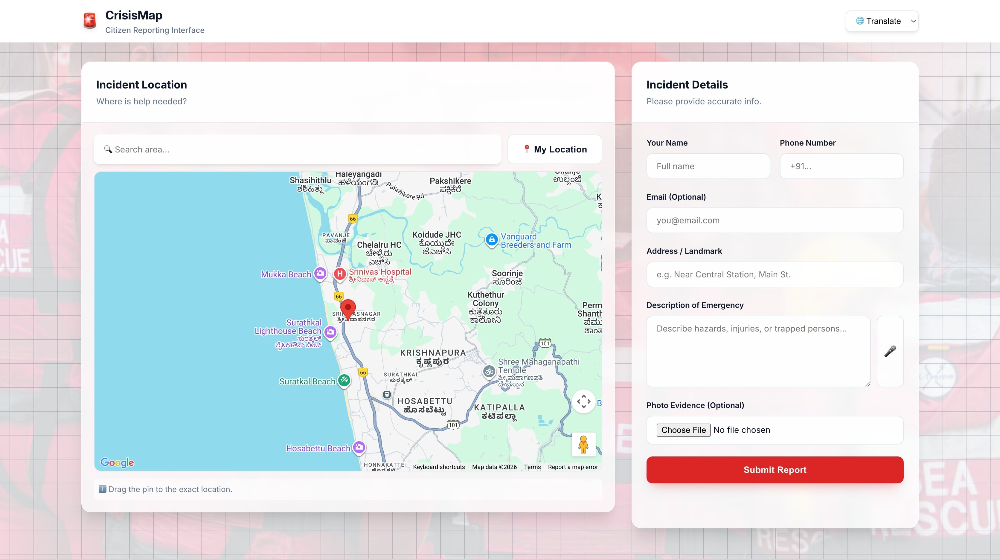
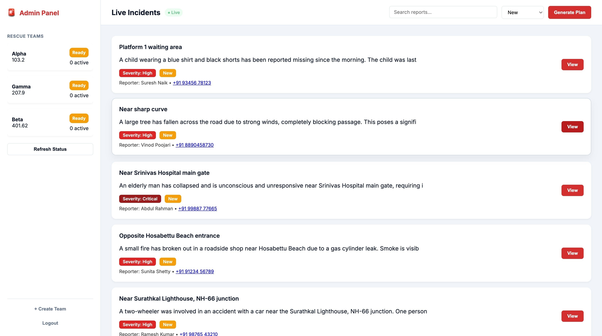
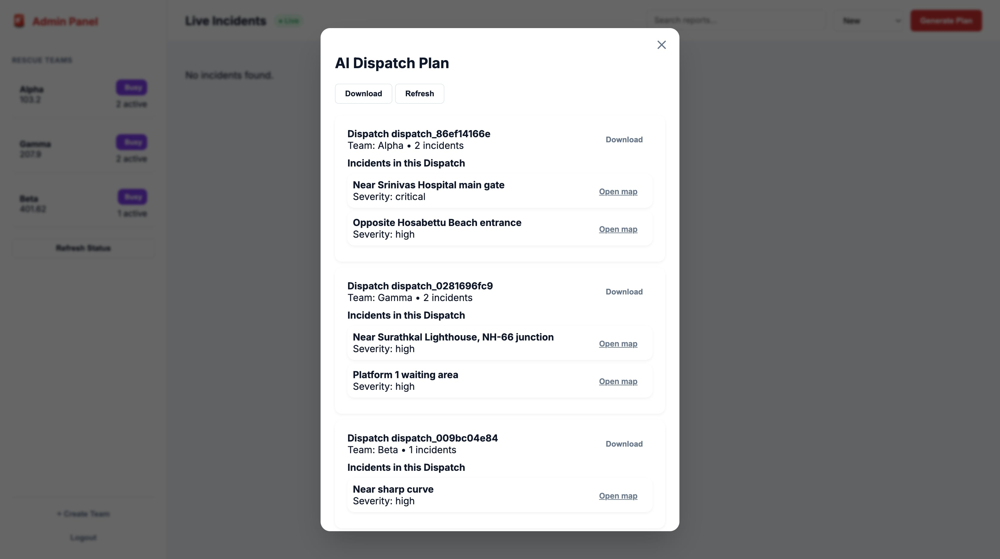
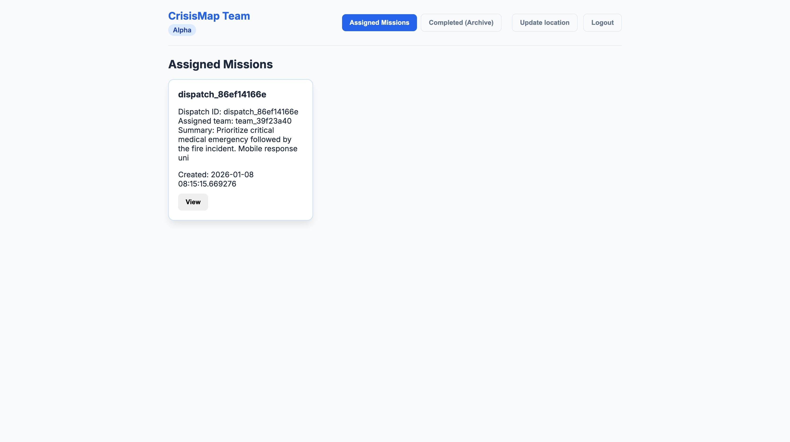
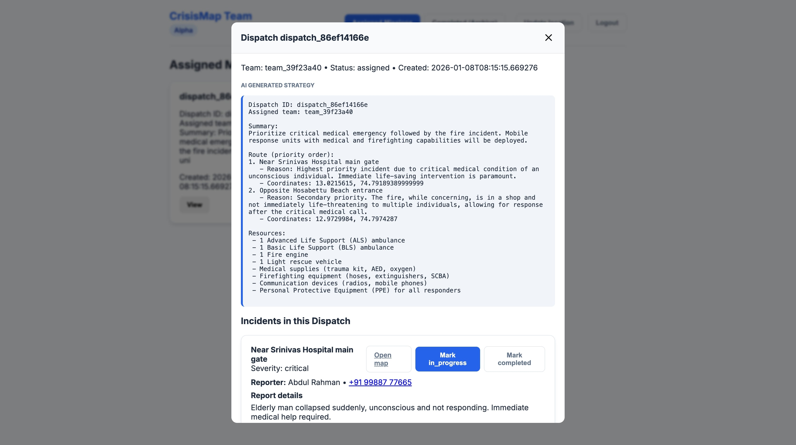
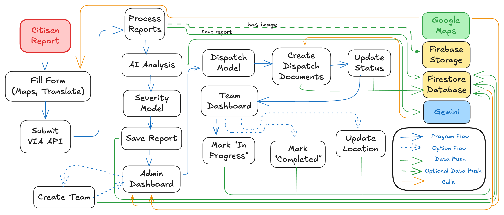

# CrisisMap

CrisisMap is a **AI-assisted emergency response platform** designed to help authorities **collect incident reports, assess severity, intelligently assign rescue teams, and track execution in real time**.

[MVP Demo](https://app.supademo.com/demo/cmk560n5l0ps8k6skpz2czf9w?utm_source=link)

The system combines:
- A **Flask backend** running locally or on a VM
- **Firestore** for real-time data persistence
- **Google Maps** for geo-visualization
- **Gemini AI** for reasoning and action-plan generation
- **Offline-trained ML models** for objective severity and dispatch decision-making

This project is built for **hackathons, emergency simulations, and disaster-management demos**, with a strong focus on **clarity, explainability, and real-world realism**.

---

## 📌 Table of Contents
1. [Overview](#overview)
2. [Problem Statement](#problem-statement)
3. [Solution Summary](#solution-summary)
4. [Key Features](#key-features)
5. [SnapShots](#snapshots)
5. [System Architecture](#system-architecture)
6. [Process Flow]
6. [Technology Stack](#technology-stack)
7. [Project Structure](#project-structure)
8. [Installation & Setup](#installation--setup)
9. [Running the Application](#running-the-application)
10. [Team](#-team)

---

## 👀 Overview

During emergencies, delays in understanding **what happened**, **how severe it is**, and **which team should respond** can cost lives.

CrisisMap solves this by:
- Allowing **citizens** to report incidents instantly
- Automatically **analyzing severity**
- **Optimally assigning** nearby teams
- Giving **clear, AI-generated action plans**
- Tracking progress until closure

---

## ❓ Problem Statement

Traditional emergency workflows suffer from:
- Manual triaging of incidents
- No real-time team location awareness
- Poor prioritization during high-load scenarios
- Fragmented communication between responders and command centers 

---

## 𝌣 Solution Summary

CrisisMap introduces an **AI and ML driven command center** that:
- Converts raw reports into structured intelligence
- Predicts incident severity using trained models
- Assigns teams using distance and workload
- Continuously updates incident and team states
- Provides full transparency to admins and responders

---

## ✨ Key Features

### Citizen Reporting
- Submit incident description
- Auto-capture or manual location input
- Optional images

### AI + ML Analysis
- **ML Severity and Assignment Model**
- Gemini-generated summaries and follow-up questions

### Admin Dashboard
- Live incident feed
- Filter & search
- Manual or AI-driven dispatch
- Team load and location visibility
- Auto-archiving of completed dispatches

### Team Dashboard
- Secure login
- Assigned dispatch view
- Google Maps navigation
- Status updates per incident

---

## Snapshots







---

## 📦 System Architecture


---

## ⏳ Process Flow



---

## 🗄️ Technology Stack

### Frontend
- HTML / CSS / Vanilla JavaScript
- Google Maps JavaScript API

### Backend
- Python Flask
- Firebase Admin SDK
- REST APIs

### AI & ML
- Gemini (Google Generative AI)
- Scikit-learn (offline training)
- Joblib model persistence

### Database
- Google Firestore (real-time)

---

## 🗂️ Project Structure

```bash
/requirements.txt
/backend/
    credentials/
        gcloud-sa.json
    routes/
        __init__.py
        admin.py
        reports.py
        speech_stt.py
        team.py
        translate.py
    services/
        __init_.py
        models/
            assignment_data.csv
            assignment_model.joblib
            severity_data.csv
            severity_model.joblib
        firestore_service.py
        gemini_service.py
        storage_service.py
        train_models.py
    app.py
    auth_store.py
    config.py
    firebase_admin_key.json
/frontend/
    admin/
        dashboard.html
        dashboard.js
        login.html
        style.css
    team/
        dashboard.html
        dashboard.js
        login.html
        style.css        
    citizen/
        form.js
        index.html
        map.js
        style.css
/venv/
/.gitignore
/.env
```

## 🚀 Installation & Setup

### Prerequisites
- python 3.10
- pip
- Git
- Google Cloud Console (For Firebase and Gemini)

### Clone Repository
```bash
git clone https://https://github.com/assaampuhel/CrisisMap.git
cd CrisisMap
```

### Create Virtual Environment and Install Dependencies
```bash
python -m venv venv (or python3 -m venv venv)
source venv/bin/activate #macos/linux
venv\Scripts\Activate

pip install --upgrade pip setuptools wheel
pip install -r requirements.txt #windows
```

### Setup API Keys
Create a file named .env in the project folder and add the following

```bash
GEMINI_API_KEY=YOUR_GEMINI_API_KEY
GOOGLE_MAPS_API_KEY=YOUR_GOOGLE_MAPS_API
FLASK_ENV=development
FIREBASE_STORAGE_BUCKET=projectid.firebasestorage.app
```
Go to Firebase Console → select your project (or create new). In the left menu choose Project settings (the gear). Open the Service accounts tab. Click Generate new private key and download the JSON. Rename the file to:

```bash
firebase_admin_key.json
```

Move this file inside the backend folder. Go to Google Cloud Console → IAM & Admin → Service Accounts. Create a new service account. Rename the file to:

```bash
gcloud-sa.json
```

Move the file to backend/credentials/

Then run the following to set environment variables

```bash
export GOOGLE_APPLICATION_CREDENTIALS=/path/to/gcloud-sa.json
```


## ▶️ Running the Application

```bash
cd backend
python app.py
```

# 👥 Team
- [Asaph Samuel](https://github.com/assaampuhel)
- [Dileep Valluru](https://github.com/Dileep1408)
- [Sai Varun Tej](https://github.com/Sai-Varun-Tej)